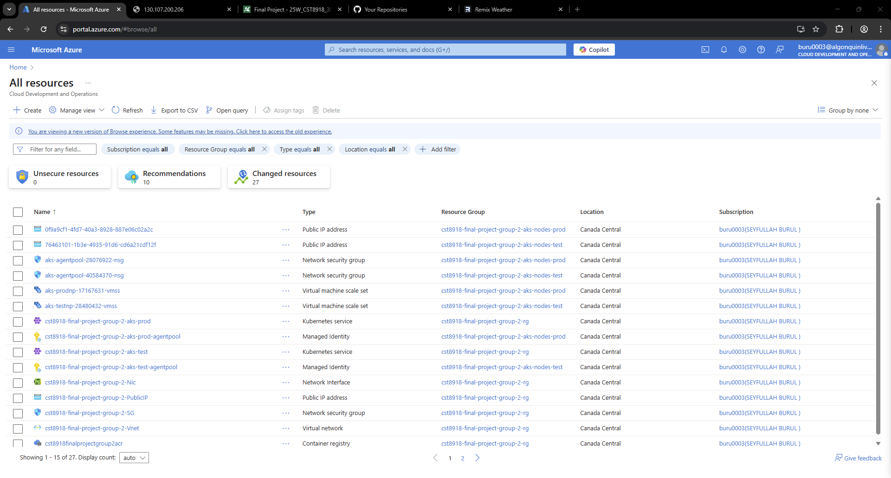
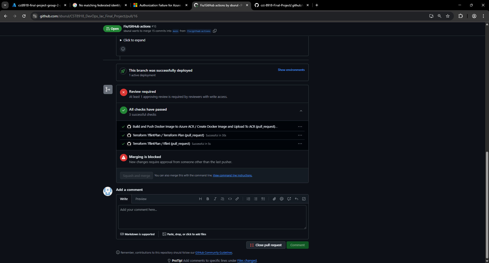
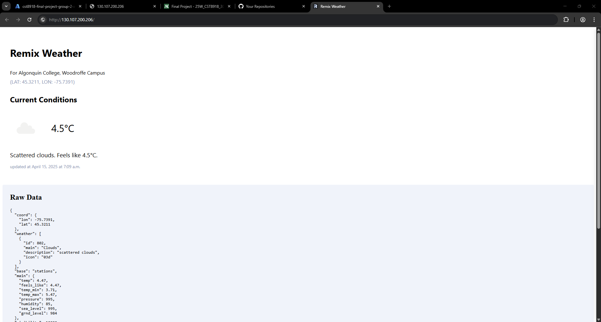

### Team Member 1: [Gulsah Avsar](https://github.com/GulsahAvsar)

### Team Member 2: [Lokman Avsar](https://github.com/Lokmanavsar)

### Team Member 3: [Serpil Dundar](https://github.com/Serpil-Dndr)

### Team Member 4: [Seyfullah Burul](https://github.com/sburul)

## Instructions
CST8918 - DevOps: Infrastructure as Code \ Prof: Robert McKenney

# Final Project: Terraform, Azure AKS, and GitHub Actions

For detailed setup instructions, refer to following links.

## GitHub Settings

Set up your repository with collaboration settings, branch protection rules, and GitHub environments to support CI/CD workflows securely.

[GitHub Settings](docs/01-github-settings.md)

## ☁️ Terraform Backend

Create and configure an Azure Blob Storage backend to store Terraform state files securely and enable remote state management across environments.

[Terraform Backend](docs/02-terraform-backend.md)

## 🔐 Azure Credentials

Generate and configure Azure credentials and federated identity settings needed to enable GitHub Actions workflows to access Azure resources.

[Azure Credentials](docs/03-azure-credentials.md)

## 🔐 GitHub Credentials

Store secrets in GitHub (like AZURE_CLIENT_ID, AZURE_TENANT_ID, and AZURE_SUBSCRIPTION_ID) to allow Terraform and Docker workflows to authenticate securely.

[GitHub Credentials](docs/04-github-credentials.md)

## 🌐 Modules: Network

Provision base network infrastructure including a resource group, virtual network, and four subnets aligned to the dev, test, prod, and admin environments.

[Modules: Network](docs/05-modules-network.md)

## ☸️ Modules: AKS

Deploy Azure Kubernetes Service (AKS) clusters for both test and production environments, configured with auto-scaling and Kubernetes version settings.

[Modules: AKS](docs/06-modules-aks.md)

## 🧠 Modules: Redis Cache

Set up Azure Cache for Redis instances in both test and production environments to optimize weather API performance through caching.

[Modules: Redis Cache](docs/07-modules-redis-cache.md)

## 🌦️ Modules: Remix Weather App

Build, push, and deploy the Remix Weather Application to AKS clusters using container images stored in Azure Container Registry (ACR).

[Modules: Remix Weather App](docs/08-modules-remix-weather-app.md)

## Screenshots

Azure Resources of Infrastructure

Github Workflows

Running Application on Production
